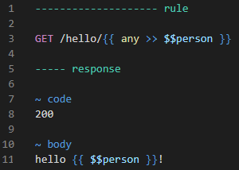

# LIRA
A simple and very functional mock server

## Key features

- simple addition of new rules by placing new files in the server’s working directory (does not require rebooting)

- a simple format for describing the rules, making it easier to write and read the rules

- escaping quotes is not required when describing the response body in `json` format

- syntax highlighting of rules in `VS Code`

- use of data ranges of different types (`int`, `float`, `guid`, `hex string`) to provide variable behavior

- the ability to describe different behavior of a method depending on the call number or time elapsed since the first call

- simple description of http callbacks

- easy ability to write arbitrary code in `C#` to match a request, generate a response and perform arbitrary actions when a rule is triggered

- a simple ability to put complex logic into separate `C# code` files (`.cs`) and use the methods described in them in any rules

- ability to add your own functions for data generation

- ability to define response templates and use them in different rules

- the ability to describe variables and use the values of these variables at different stages of rule processing (response, callbacks, additional actions performed when processing the rule)

- the ability to save arbitrary data in the cache and use it to match requests and generate a response

- ability to add custom directories for data generation and comparison

- ability to obtain values of dynamically matched data


## Requirements
Docker installed


<!---

## References

[Guide](docs/guide.md)

[Query matching](docs/matching.md)

[Generating responses](docs/generating.md)

[Ranges](docs/ranges.md)

--->

## Getting Started

### Launch

- create a directory `c:/rules` in which the rules for **LIRA** will be located (you can specify any other directory)
- run the command:

`docker run -p 80:80 -e TZ=Europe/Moscow -v c:/lira/rules:/app/rules mnkvsoft/lira`

You can make sure that the server is running by going to the following address in your browser:

`http://localhost`

if the server is running, the browser will display the text: *Rule not found*

### Adding the first rule
You need to create a text file `hello.rules` with the following content in the `c:/rules` directory:

[hello.rules](docs/examples/quick_start/hello.rules)

```
-------------------- rule

GET /hello/{{ any >> $$person}}

----- response

~ code
200

~ body
hello {{ $$person }}!
```

Testing the first rule in the browser by making a request to the resource

`http://localhost/hello/Nikolas`

the server will give us a response with the http code `200` and the response body `hello Nikolas!`

```
200

Hello Nikolas!
```

[Guide](docs/guide.md)

### Syntax highlighting

To work with rules, it is recommended to use Visual Studio Code,
with the syntax highlighting extension installed



[Instructions for installing the extension](docs/highlight_setup.md)

### Example rules

To create rules, add files with the extension `.rules` to the `c:/rules` directory

All examples are available in the `docs/examples` directory

:triangular_flag_on_post: For some examples, the header `example:[example name]` is used,
so that there is no overlap with the rules from other examples.
There is no need to focus on it in the examples.

:triangular_flag_on_post: To make it easier to read, if the http code is not specified in the example response, then the code `200` is assumed

### Static rule
[static.rules](docs/examples/quick_start/static.rules)

```
-------------------- rule

GET /hi

----- response

~ code
200

~ body
hello!
```

Request
```
curl --location 'http://localhost/hi'
```

Response
```
hello!
```


### Response delay
[delay.rules](docs/examples/quick_start/delay.rules)

```
-------------------- rule

GET /delay

----- response

~ delay
2000 ms

~ code
200

~ body
long query
```

Request
```
curl --location 'http://localhost/delay'
```

Response with a delay of 2000 milliseconds
```
long query
```

### Simulate server failure
[fault.fault](docs/examples/quick_start/fault.rules)
```
-------------------- rule

GET /fault

----- response

~ fault
```
Request
```
curl --location 'http://localhost/fault'
```
When processing a request, the server will not produce a result (`ERR_EMPTY_RESPONSE`)


### Dynamic mapping of query parameters by system functions
[match_dynamic.rules](docs/examples/quick_start/match_dynamic.rules)

```
-------------------- rule

POST /payment/{{ any }}?fast={{ any }}

~ headers
Request-Id: {{ guid }}

~ body
{{ jpath: $.number }} >> 4444{{ int }}

----- response

~ code
200

~ body
{
    "id": 12345,
    "status": "ok"
}
```
Request
```
curl --location 'http://localhost/payment/card?fast=true' \
--header 'Request-Id: 60a37f8e-0c7f-4404-8dda-64eaf6d13e6a' \
--header 'Content-Type: application/json' \
--data '{
    "number": 4444111122223333
}'

```

Response
```
{
    "id": 12345,
    "status": "ok"
}
```

<!---

#### References

[Guide](docs/guide.md)

[Matching functions](docs/match_functions.md)
--->


### Dynamic mapping of request parameters with a short C# block
[match_dynamic_csharp_short.rules](docs/examples/quick_start/match_dynamic_csharp_short.rules)

```
-------------------- rule

POST /payment/{{ value == "card" || value == "account" }}

~ headers
example: match_dynamic_csharp_short
Request-Id: {{ Guid.TryParse(value, out var ) }}


----- response

~ code
200

~ body
{
    "id": 12345,
    "status": "ok"
}
```
Request
```
curl --location --request POST 'http://localhost/payment/account' \
--header 'Request-Id: 8e8bd1c3-2ab1-4145-8098-ca78d9ee9aae' \
--header 'example: match_dynamic_csharp_short'
```

Response
```
{
    "id": 12345,
    "status": "ok"
}
```

Request
```
curl --location --request POST 'http://localhost/payment/card' \
--header 'Request-Id: a4442d86-0523-4209-911c-28a16a3f22c8' \
--header 'example: match_dynamic_csharp_short'
```

Response
```
{
    "id": 12345,
    "status": "ok"
}
```

<!---
#### References

[Guide](docs/guide.md)

[Matching functions](docs/match_functions.md)

--->


### Dynamic matching of query parameters with a full C# block
[match_dynamic_csharp_full.rules](docs/examples/quick_start/match_dynamic_csharp_full.rules)

```
-------------------- rule

GET /payment/{{ 
    if(!int.TryParse(value, out var intValue))
        return false;
    return intValue < 10;
}}

~ headers
example: match_dynamic_csharp_full

----- response

~ body
{
    "id": 12345,
    "status": "ok"
}

-------------------- rule

GET /payment/{{ 
    if(!int.TryParse(value, out var intValue))
        return false;
    return intValue >= 10;
}}

~ headers
example: match_dynamic_csharp_full

----- response

~ body
{
    "id": 12345,
    "status": "pending"
}
```

Request
```
curl --location 'http://localhost/payment/1' \
--header 'example: match_dynamic_csharp_full'
```

Response
```
{
    "id": 12345,
    "status": "ok"
}
```

Request
```
curl --location 'http://localhost/payment/10' \
--header 'example: match_dynamic_csharp_full'
```

Response
```
{
    "id": 12345,
    "status": "pending"
}
```

<!---
#### References

[Guide](docs/guide.md)

[Matching functions](docs/match_functions.md)
--->


### Dynamic response generation
[generation_dynamic.rules](docs/examples/quick_start/generation_dynamic.rules)

```
-------------------- rule

GET /order

----- response

~ code
200

~ headers
Request-Time: {{ now >> format: H:mm:ss }}

~ body
{
    "id": {{ int }},
    "status": "{{ random: paid, pending, cancelled }}",
    "amount": {{ dec }},
    "transaction_id": "{{ guid }}",
    "created_at": "{{ date >> format: yyyy-MM-dd HH:mm:ss }}",
    "customer": "{{ str }}"
}
```
Request
```
curl --location 'http://localhost/order'
```

Response
```
Request-Time: 12:07:16

{
    "id": 566607986,
    "status": "pending",
    "amount": 5413.93,
    "transaction_id": "60c50923-8230-44db-96cc-b4f75ba4e5bc",
    "created_at": "2023-06-29 13:58:38",
    "customer": "eyshxbdiwf1d6991nhjd"
}
```
<!---
#### References

[Guide](docs/guide.md)

[Generation functions](docs/generation_functions.md)
--->


### Extracting request parameters
[extract_request_data.rules](docs/examples/quick_start/extract_request_data.rules)

```
-------------------- rule

POST /payment/{{ any }}?fast={{ any }}

~ headers
Id: {{ any }}

~ body
{{ jpath: $.account }} >> {{ any }}

----- response

~ code
200

~ headers
Request-Id: {{ req.header: Id}}

~ body
{
    "tool": "{{ req.path: 1 }}",
    "is_fast": "{{ req.query: fast }}",
    "account": "{{ req.body.jpath: $.account }}"
}
```
Request
```
curl --location 'http://localhost/payment/account?fast=false' \
--header 'Id: 987' \
--header 'Content-Type: application/json' \
--data '{
    "account": "9876543210"
}'
```

Response
```
Request-Id: 987

{
    "tool": "account",
    "is_fast": "false",
    "account": "9876543210"
}
```
<!---
#### References

[Guide](docs/guide.md)

[Generation functions](docs/generation_functions.md)
--->

### Extracting dynamically mapped data

[extract.value.system.rules](docs/examples/quick_start/extract.value.system.rules)

```
-------------------- rule

GET /balance/7{{ int >> $$phone }}

~ headers
example: extract.value.system

----- response

~ body
{
    "phone": {{ $$phone }},
    "balance": {{ dec }}
}
```
Request
```
curl --location 'http://localhost/balance/79161112233' \
--header 'example: extract.value.system'
```

Response
```
{
    "phone": 9161112233,
    "balance": 287.49
}
```


### Using Variables
The value of the variable is calculated once during request processing.

It is used to pass the same calculated dynamic value to different parts of the request.

Often used when implementing callbacks (to be discussed later).

[variables.rules](docs/examples/quick_start/variables.rules)
```
-------------------- rule

POST /payment

~ headers
example: variables

----- declare

$$requestId = {{ guid }}

----- response

~ code
200

~ headers
Request-Id: {{ $$requestId >> format: N }}

~ body
{
    "request_id": "{{ $$requestId }}"
}
```
Request
```
curl --location --request POST 'http://localhost/payment' \
--header 'example: variables'
```

Response
```
Request-Id: 1cfc7bc5ea6146a79dc2820fe7c6c63c

{
    "request_id": "1cfc7bc5-ea61-46a7-9dc2-820fe7c6c63c"
}
```
<!---
#### References

[Guide](docs/guide.md)
--->


### Callbacks
[call.rules](docs/examples/quick_start/call.rules)

```
-------------------- rule

POST /payment

~ headers
example: call

----- declare

$$id = {{ seq }}

----- response

~ code
200

~ body
{
    "id": {{ $$id }}, 
    "status": "pending"
}

----- action.call.http

POST http://localhost/api/callback

~ delay 
100 ms

~ headers
Content-Type: application/json

~ body
{
    "id": {{ $$id }}, 
    "status": "ok"
}


-------------------- rule

POST /api/callback

----- response

~ code
200
```
Request
```
curl --location --request POST 'http://localhost/payment' \
--header 'example: call'
```

Response
```
{
    "id": 338, 
    "status": "pending"
}

```
Callback
```
POST http://localhost/api/callback
      
Content-Type: application/json; charset=utf-8
Content-Length: 42
      
{
    "id": 338, 
    "status": "ok"
}
```

<!---
#### References

[Guide](docs/guide.md)
--->


### Comments
[comments.rules](docs/examples/quick_start/comments.rules)
```
-------------------- rule

GET /comments

----- response

~ code
200

~ body
## single line comment 
###
    it's multiline
    comment
### 
hello!## comment the rest of the line
hello ### comment in the middle of the line ### world!
```
Request
```
curl --location 'http://localhost/comments'
```

Response
```
hello!
http://hello
```


### Rule prioritization
One request can match several rules,
LIRA will choose the most private one (this is the default behavior, it is configurable)

[priority.rules](docs/examples/quick_start/priority.rules)
```
-------------------- rule

GET /priority/{{ any }}

----- response

~ code
200

~ body
rule with ANY

-------------------- rule

GET /priority/{{ guid }}

----- response

~ code
200

~ body
rule with GUID

-------------------- rule

GET /priority/{{ guid }}

~ headers
Request-Id: {{ any }}

----- response

~ code
200

~ body
rule with GUID and header
```
Request
```
curl --location 'http://localhost/priority/1'
```
Response
```
rule with ANY
```

Request
```
curl --location 'http://localhost/priority/6EC35301-1CF0-4F9B-8472-8CD8EBA02105'
```
Response
```
rule with GUID
```

Request
```
curl --location 'http://localhost/priority/6EC35301-1CF0-4F9B-8472-8CD8EBA02105' \
--header 'Request-Id: 1'
```
Response
```
rule with GUID and header
```

### Variability of responses

As a rule, it is required to check the behavior of the source system under different options
response from an external system. Such variability is adjusted using *ranges*.
Ranges are described in `*.ranges.json` files


#### Variability of responses. Simple example

Depending on the payment amount, we will issue different statuses: `ok` or `reject`

File `global.ranges.json`

```json
{
    "amount": {
      "type": "dec",
      "ranges": [
        "ok",
        "reject"
      ]
    }
} 
```

[ranges.easy.rules](docs/examples/quick_start/ranges.easy.rules)

```
-------------------- rule

POST /payment

~ headers
example: range.easy

~ body
{{ jpath: $.amount }} >> {{ range: amount/ok }}

----- response

~ code
200

~ body
{
    "status": "ok"
}

-------------------- rule

POST /payment

~ body
{{ jpath: $.amount }} >> {{ range: amount/reject }}

----- response

~ code
200

~ body
{
    "status": "reject"
}
```

Getting the value of the `amount` field to receive a response with the status `ok`

Request
```
curl --location 'http://localhost/sys/range/val/amount/ok/1'
```

Response
```
201534.92
```

Uses the value `201534.92` received in the response to perform the request

```
curl --location 'http://localhost/payment' \
--header 'example: range.easy' \
--header 'Content-Type: application/json' \
--data '{
    "amount": 201534.92
}'
```
Response
```
{
    "status": "ok"
}
```
To receive a response with the `reject` status, ask for the `amount` value for it
```
curl --location 'http://localhost/sys/range/val/amount/reject/1'
```
Response
```
401386.54
```
Uses the value `401386.54` received in the response to perform the request
```
curl --location 'http://localhost/payment' \
--header 'example: range.easy' \
--header 'Content-Type: application/json' \
--data '{
    "amount": 401386.54
}'
```
Response
```
{
    "status": "reject"
}
```


#### Variability of responses. Complicated example

Let's assume that when making a payment, we return its identifier `payment_id` to the system under test and then use this identifier to refund the payment. We need to provide two different responses to refund:
`ok` or `reject`.

Let's look at how this is configured using ranges

Let's change the file [global.ranges.json](docs/examples/quick_start/global.ranges.json) as follows

```json
{
    "amount": {
      "type": "dec",
      "ranges": [
        "ok",
        "reject",
        "refund_reject"
      ]
    },
    "payment_id": {
      "type": "int",
      "ranges": [
        "ok",
        "refund_reject"
      ]
    }
  }
  
```

[ranges.medium.rules](docs/examples/quick_start/ranges.medium.rules)

```
## ok refund rule

-------------------- rule

POST /payment

~ headers
example: range.medium

~ body
{{ jpath: $.amount }} >> {{ range: amount/ok }}

----- response

~ code
200

~ body
{
    "id": {{ range: payment_id/ok }},
    "status": "ok"
}

-------------------- rule

POST /payment/refund/{{ range: payment_id/ok}}

~ headers
example: range.medium

----- response

~ code
200

~ body
{
    "status": "ok"
}

## reject refund rule

-------------------- rule

POST /payment

~ headers
example: range.medium

~ body
{{ jpath: $.amount }} >> {{ range: amount/refund_reject }}

----- response

~ code
200

~ body
{
    "id": {{ range: payment_id/refund_reject }},
    "status": "ok"
}

-------------------- rule

POST /payment/refund/{{ range: payment_id/refund_reject}}

~ headers
example: range.medium

----- response

~ code
200

~ body
{
    "status": "reject"
}
```

***Scenario for obtaining `ok` status for refund***

Getting the value of the `amount` field to receive a response with the status `ok`

Request
```
curl --location 'http://localhost/sys/range/val/amount/ok/1'
```

Response
```
118297.44
```

Uses the value `118297.44` received in the response to perform the request

```
curl --location 'http://localhost/payment' \
--header 'example: range.medium' \
--header 'Content-Type: application/json' \
--data '{
    "amount": 118297.44
}'
```
Response
```
{
    "id": 1,
    "status": "ok"
}

```
We use the received `id` value to perform a refund
```
curl --location --request POST 'http://localhost/payment/refund/1' \
--header 'example: range.medium'
```
Response
```
{
    "status": "ok"
}

```

***Scenario for obtaining the `reject` status for a refund***


To receive a response with the `reject` status for a refund, we request the `amount` value for it
```
curl --location 'http://localhost/sys/range/val/amount/refund_reject/1'
```
Response
```
742387.47
```
Uses the value `742387.47` received in the response to rerform the request
```
curl --location 'http://localhost/payment' \
--header 'example: range.medium' \
--header 'Content-Type: application/json' \
--data '{
    "amount": 742387.47
}'
```
Response
```
{
    "id": 4611686018427387904,
    "status": "ok"
}
```
We use the received `id` value to perform a refund
```
curl --location --request POST 'http://localhost/payment/refund/4611686018427387904' \
--header 'example: range.medium'
```
Response
```
{
    "status": "reject"
}
```
<!---
#### References

[Ranges](docs/ranges.md)

[Guide](docs/guide.md)

--->


### Variability of responses with unchanged request data

:triangular_flag_on_post: If you run this example in Postman,
then you need to disable the function of adding the Postman-Token header,
because a new value is written to it with each request
and the server interprets such requests as different

[conditions.rules](docs/examples/quick_start/conditions.rules)
```
---------------------------- rule

GET /payment/status

--------------- condition

elapsed < 2 second

----- response

~ code
200

~ body
{
    "status": "registered"
}

--------------- condition

elapsed in [2 second - 4 second]

----- response

~ code
200

~ body
{
    "status": "pending"
}


--------------- condition

elapsed > 4 second

----- response

~ code
200

~ body
{
    "status": "ok"
}
```
Request
```
curl --location 'http://localhost/pay/status'
```

Responseы:

Less than 2 seconds have passed since the first request
```
{
    "status": "registered"
}
```
2 to 4 seconds have passed since the first request
```
{
    "status": "pending"
}
```
More than 4 seconds have passed since the first request
```
{
    "status": "ok"
}
```


### Defining your own functions
[custom_function.rules](docs/examples/quick_start/custom_function.rules)

```
-------------------- rule

POST /payment

~ headers
example: custom_function

----- declare

@payment.now = {{ now >> format: dd MMM yyyy hh:mm tt }}

----- response

~ code
200

~ body
{
    "created_at": "{{ @payment.now }}"
    
    ## the '#' symbol can be omitted when calling a function
    ## "created_at": "{{ payment.now }}"
}
```
Request
```
curl --location --request POST 'http://localhost/payment' \
--header 'example: custom_function'
```

Response
```
{
    "created_at": "09 Sep 2023 02:36 PM"
}
```
<!---
#### References

[Guide](docs/guide.md)
--->


### Common variables and functions
Variables and functions can be declared at the rules file level
and in this case, reuse within one file,
or declare it at the global level and use it in any rule

#### Declaration at the file level

[declare.shared.file.rules](docs/examples/quick_start/declare.shared.file.rules)

```
-------------------- declare

@amount = {{ dec: [1 - 100] }}

-------------------- rule

GET /payment

~ headers
example: declare.shared.file

----- response

~ code
200

~ body
{
    "amount": {{ amount }}
}

-------------------- rule

GET /account

~ headers
example: declare.shared.file

----- response

~ code
200

~ body
{
    "balance": {{ amount }}
}
```
Request
```
curl --location 'http://localhost/payment' \
--header 'example: declare.shared.file'
```
Response
```
{
    "amount": 26.81
}
```

Request
```
curl --location 'http://localhost/account' \
--header 'example: declare.shared.file'
```
Response
```
{
    "balance": 59.26
}
```
<!---
#### References

[Guide](docs/guide.md)
--->

#### Declaration at the global level
Declaration at the global level is made in `*.declare` files

Let's add a file
[declare.shared.global.declare](docs/examples/quick_start/declare.shared.global.declare)

```
@age = {{ int: [1 - 122]}}
```

Let's create a rule

[declare.shared.global.rules](docs/examples/quick_start/declare.shared.global.rules)

```
-------------------- rule

GET /person

~ headers
example: declare.shared.global

----- response

~ code
200

~ body
{
    "age": {{ age }}
}
```

Request
```
curl --location 'http://localhost/person' \
--header 'example: declare.shared.global'
```
Response
```
{
    "age": 64
}
```


### Multiline variables and functions
Variables and functions support multiline declarations.
This can be used to create response templates

[multiline_functions.rules](docs/examples/quick_start/multiline_functions.rules)
```
-------------------- declare

@template.order = 
{
    "id": {{ int }},
    "status": "paid",
    "amount": {{ dec }},
    "transaction_id": "{{ guid }}",
    "created_at": "{{ date >> format: yyyy-MM-dd HH:mm:ss }}",
    "customer": "{{ str }}"
}

-------------------- rule

POST /order

~ headers
example: multiline_functions

----- response

~ code
200

~ body
{{ template.order }}

-------------------- rule

GET /order

~ headers
example: multiline_functions

----- response

~ code
200

~ body
{{ template.order }}
```
Request
```
curl --location --request POST 'http://localhost/order' \
--header 'example: multiline_functions'
```
Response
```
{
    "id": 1930876293,
    "status": "paid",
    "amount": 7081.21,
    "transaction_id": "d282e241-6ddc-47a7-bc84-ebc548b6a0c9",
    "created_at": "2015-03-30 07:21:45",
    "customer": "zsiw62s7hdj4vq7iw1xz"
}
```
Request
```
curl --location 'http://localhost/order' \
--header 'example: multiline_functions'
```
Response
```
{
    "id": 1874972789,
    "status": "paid",
    "amount": 3537.29,
    "transaction_id": "553cca6b-1501-4a45-a548-90d3de60c48d",
    "created_at": "2016-09-12 17:13:58",
    "customer": "fk1f9kw3nwbd01o8tyrs"
}
```


### Custom dictionaries
System functions cannot satisfy all possible needs for generating random data.

To do this, you can use custom dictionaries.

To define it, you need to add a text file with
extension `.dic`, the file name without the extension `.dic` is the name of the dictionary.

Each line is a directory value.

#### Data generation
[name.first.dic](docs/examples/quick_start/name.first.dic)
```
Nikolay
John
Leon
```
[name.last.dic](docs/examples/quick_start/name.last.dic)
```
Ivanov
Müller
Fischer
Jones
```
[dic.generation.rules](docs/examples/quick_start/dic.generation.rules)
```
-------------------- rule

GET /person

~ headers
example: dic.generation

----- response

~ body
{
    "name": "{{ name.first }} {{ name.last }}"
}
```
Request
```
curl --location 'http://localhost/person' \
--header 'example: dic.generation'
```
Response
```
{
    "name": "John Fischer"
}
```
#### Matching
[car.dic](docs/examples/quick_start/car.dic)
```
ACURA
ALFA ROMEO
ASTON MARTIN
...
```
[dic.match.rules](docs/examples/quick_start/dic.match.rules)
```
-------------------- rule

GET /product/{{ car }}

~ headers
example: dic.match

----- response

~ body
{
    "release_date": "{{ date }}"
    "engine_capacity": {{ dec: [0.5 - 10] }}
}
```
Request
```
curl --location 'http://localhost/product/ACURA' \
--header 'example: dic.match'
```
Response
```
{
    "release_date": "2023-08-27T13:53:01.8264609"
    "engine_capacity": 3.72
}
```


### Repeating blocks

[repeat_block.rules](docs/examples/quick_start/repeat_block.rules)
```
-------------------- rule

GET /orders/{{ int ### customer id ### }}

~ headers
example: repeat_block

----- declare

@order = 
{
    "id": {{ int }},
    "status": "{{ random: paid, pending, cancelled }}",
    "amount": {{ dec }},
    "transaction_id": "{{ guid }}",
    "created_at": "{{ date >> format: yyyy-MM-dd HH:mm:ss }}"
}


----- response

~ body
{
    "orders": [
        {{ repeat(@order, separator: ",", count: 3) }}    
    ]
}
```
Request
```
curl --location 'http://localhost/orders/123' \
--header 'example: repeat_block'
```
Response
```
{
  "orders": [
    {
      "id": 1569319761,
      "status": "paid",
      "amount": 2188.83,
      "transaction_id": "1eca0a54-a7a8-46dd-aaec-5e06876b1903",
      "created_at": "2023-05-24 03:54:36"
    },
    {
      "id": 14734951,
      "status": "paid",
      "amount": 3588.62,
      "transaction_id": "21a593d5-0a88-4ea0-8194-e97e5fc2a418",
      "created_at": "2023-05-15 19:39:23"
    },
    {
      "id": 1399041927,
      "status": "pending",
      "amount": 7807.53,
      "transaction_id": "66a8494b-f625-468d-87ae-b1fc05619583",
      "created_at": "2023-08-10 03:24:24"
    }
  ]
}
```


#### Changing the value of json nodes in response templates
Often in json response templates (which are simply functions that generate some values) you need to change some of the data and leave the rest unchanged. This is done by explicitly defining the function's return type as `json`. The block in which the function is used is a block of `C#` code, which will be discussed below.

:triangular_flag_on_post: When calling functions in C# blocks
The ` character used in function declarations cannot be omitted

[change_json.rules](docs/examples/quick_start/change_json.rules)
```
-------------------- declare

@template.order:json = 
{
    "id": {{ int }},
    "status": "paid",
    "amount": {{ dec }},
    "transaction_id": "{{ guid }}",
    "created_at": "{{ date >> format: yyyy-MM-dd HH:mm:ss }}",
    "customer": "{{ str }}"
}

-------------------- rule

POST /order

~ headers
example: change_json

----- response

~ code
200

~ body
{{ 
    @template.order
        .replace("$.status", "pending")
        .replace("$.customer", "vasily pupkin")
}}

-------------------- rule

GET /order

~ headers
example: change_json

----- response

~ code
200

~ body
{{ 
    @template.order
        .replace("$.status", "refunded")
        .replace("$.customer", "nikolas john")
}}
```
Request
```
curl --location --request POST 'http://localhost/order' \
--header 'example: change_json'
```
Response
```
{
  "id": 1753774650,
  "status": "pending",
  "amount": 3528.46,
  "transaction_id": "9dfa5667-9c17-4dbb-9b18-74553c26746e",
  "created_at": "2022-11-18 05:16:21",
  "customer": "vasily pupkin"
}
```
Request
```
curl --location 'http://localhost/order' \
--header 'example: change_json'
```
Response
```
{
  "id": 1545541359,
  "status": "refunded",
  "amount": 6965.61,
  "transaction_id": "fca022d3-254d-4873-afb7-495996665c26",
  "created_at": "2013-11-19 20:14:38",
  "customer": "nikolas john"
}
```


### Defining dynamic blocks in C#
In some cases, the functionality of the built-in functions is not enough to describe specific logic. In this case, you can use code blocks in C#


#### Short blocks
Imply instructions without the use of additional variables and
returning **not** `void` value

[charp.short.rules](docs/examples/quick_start/charp.short.rules)
```
-------------------- rule

GET /very/old/event

----- response

~ code
200

~ body
{
    "date": {{ DateTime.Now.AddYears(-100 - Random.Shared.Next(1, 100)) }}
}
```
Request
```
curl --location 'http://localhost/very/old/event'
```
Response
```
{
    "date": 0926-11-12T14:14:55.0009386+02:31
}
```


#### Full blocks
[charp.full.rules](docs/examples/quick_start/charp.full.rules)
```cs
-------------------- rule

POST /payment/card

~ headers
example: csharp.full 

~ body
{{ jpath: $.number }} >> {{ any }}

----- response

~ code
200

~ body
{
    "mnemonic": {{ 
        string cardNumber = req.body.jpath("$.number");

        string paymentSystem;
        switch(cardNumber[0])
        {
            
            case '2':
                paymentSystem = "MIR";
                break;
            case '4':
                paymentSystem = "VISA";
                break;
            case '5':
                paymentSystem = "MASTERCARD";
                break;
            default:
                paymentSystem = "";
                break;
        }

        string last4 = cardNumber[^4..];
        string result = paymentSystem + " *" + last4;
        return result;
     }}
}
```
Request
```
curl --location 'http://localhost/payment/card' \
--header 'example: csharp.full' \
--header 'Content-Type: text/plain' \
--data '{
    "number": "2222333344445678"
}'
```
Response
```
{
    "mnemonic": "MIR *5678"
}
```

#### Extractiong dynamically matched data in blocks in C#

[extract.value.charp.rules](docs/examples/quick_start/extract.value.charp.rules)

```
-------------------- rule

GET /balance/7{{ int >> $$phone }}

~ headers
example: extract.value.charp

----- response

~ body
{
    "phone": {{ $$phone }}
    "balance": {{ dec }}
}
```
Request
```
curl --location 'http://localhost/balance/79161112233' \
--header 'example: extract.value.csharp'
```

Response
```
{
    "phone": 9161112233,
    "balance": 3049.48
}
```

#### Defining classes
To share logic, `*.cs` files are used with specific
they contain classes and methods in C#.

It should be noted that in the example, the data for calculating the card mnemonics is extracted from different
fields

[CardNumber.cs](docs/examples/quick_start/CardNumber.cs)
```cs
namespace _;

public static class CardNumber
{
    public static string GetMnemonic(string cardNumber)
    {
        string paymentSystem;
        switch(cardNumber[0])
        {
            case '2':
                paymentSystem = "MIR";
                break;
            case '4':
                paymentSystem = "VISA";
                break;
            case '5':
                paymentSystem = "MASTERCARD";
                break;
            default:
                paymentSystem = "";
                break;
        }

        string last4 = cardNumber[^4..];
        string result = paymentSystem + " *" + last4;
        
        return result;
    }
}
```
[charp.class.mnenonic.rules](docs/examples/quick_start/charp.class.mnenonic.rules)
```
-------------------- rule

POST /payment/card

~ headers
example: charp.class.mnenonic

~ body
{{ jpath: $.number }} >> {{ any }}

----- response

~ code
200

~ body
mnemonic was generated from 'number' field: {{ 
    CardNumber.GetMnemonic(req.body.jpath("$.number")) 
}}


-------------------- rule

POST /payment/card

~ headers
example: charp.class.mnenonic

~ body
{{ jpath: $.pan }} >> {{ any }}

----- response

~ code
200

~ body
mnemonic was generated from 'pan' field: {{ 
    CardNumber.GetMnemonic(req.body.jpath("$.pan")) 
}}
```
Request
```
curl --location 'http://localhost/payment/card' \
--header 'example: charp.class.mnenonic' \
--header 'Content-Type: application/json' \
--data '{
    "number": "2222333344445678"
}'
```
Response
```
mnemonic was generated from 'number' field: MIR *5678
```
Request
```
curl --location 'http://localhost/payment/card' \
--header 'example: charp.class.mnenonic' \
--header 'Content-Type: application/json' \
--data '{
    "pan": "2222333344445678"
}'
```
Response
```
mnemonic was generated from 'pan' field: MIR *5678
```

#### Example of overlaying a signature
[SignatureCalculator.cs](docs/examples/quick_start/SignatureCalculator.cs)
```cs
using System.Security.Cryptography;
using System.Text;

namespace _my;

public static class SignatureCalculator
{
    public static string Get(string text, string key)
    {
        byte[] bytes = Encoding.UTF8.GetBytes(text + key);
        using var sha1 = SHA1.Create();
        byte[] hash = sha1.ComputeHash(bytes);

        var sb = new StringBuilder(bytes.Length * 2);

        foreach (var b in hash)
        {
            sb.Append(b.ToString("x2"));
        }

        return sb.ToString();
    }
}

```
[charp.class.sign.rules](docs/examples/quick_start/charp.class.sign.rules)
```
-------------------- rule

POST /payment

~ headers
example: charp.class.sign

----- declare

@response = 
{
    "id" : {{ int }},
    "created_at": "{{ now }}",
    "status": "ok"
}

----- response

~ code
200

~ body
{{
    json(@response)
        .add("sign", SignatureCalculator.Get(@response, "very_secret_key"))
}}
```
Request
```
curl --location --request POST 'http://localhost/payment' \
--header 'example: charp.class.sign'
```
Response
```
{
  "id": 911482583,
  "created_at": "09/17/2023 16:19:33",
  "status": "ok",
  "sign": "d4bfbc5b9077d41f7105ad65b047f3f94232d617"
}
```

### Using interval functionality in C# blocks

#### For matching

Sometimes the function for determining membership in a range (`range`) requires
pass the previously modified value. This may be necessary, for example,
in cases where one of the APIs takes a value not in basic currency units (rubles, dollars, euros, etc.), but in minimal ones (kopecks, cents, etc.) and the application multiplies the original value before transmitting the value. In this case, we need to first change the value by dividing it by the desired amount.

The `value` system variable is used to access the current value.

[global.ranges.json](docs/examples/quick_start/global.ranges.json)

[ranges.csharp.match.rules](docs/examples/quick_start/ranges.csharp.match.rules)
```
-------------------- rule

POST /payment

~ headers
example: ranges.csharp.match

~ body
{{ jpath: $.amount }} >> {{ 

if(!decimal.TryParse(value, out decimal amountInCents))
    return false;

decimal amount = amountInCents / 100;
return range("amount/ok", amount);

}}

###

## short version for division
~ body
{{ jpath: $.amount }} >> {{ range("amount/ok", value, divide: 100) }}

## short version for division 2
~ body
{{ jpath: $.amount }} >> {{ range("amount/ok", value, x => x / 100) }}

## short version for multiplication
~ body
{{ jpath: $.amount }} >> {{ range("amount/ok", value, multiply: 100) }}

## short version for multiplication 2
~ body
{{ jpath: $.amount }} >> {{ range("amount/ok", value, x => x * 100) }}

###

----- response

~ body
{
    "status": "ok"
}
```
Request
```
curl --location 'http://localhost/payment' \
--header 'example: range.csharp' \
--header 'Content-Type: application/json' \
--data '{
    "amount": 20153492
}'
```
Response
```
{
    "status": "ok"
}
```

#### For generation
```
-------------------- rule

GET /payment

~ headers
example: ranges.csharp.generation

----- response

~ code
200

~ body
{
    "status": "ok"
    "fee": {{ range("amount/ok") * 100 >> format: #. ### without decimals ### }}
}
```
Request
```
curl --location --request GET 'http://localhost/payment' \
--header 'example: ranges.csharp.generation' \
--header 'Content-Type: application/json' \
--data '{
    "amount": 20153492
}'
```
Response
```
{
    "status": "ok"
    "fee": 13920288
}
```

### Execute arbitrary code when processing a rule
In some cases, arbitrary logic needs to be executed during rule processing. This can be done in the `action` section.

In the example below, the first rule saves the file, and the second
a check is made for the existence of the file and, if the file exists, the response body is read from it and one of the fields is changed.

[action.rules](docs/examples/quick_start/action.rules)
```
-------------------- rule

POST /order

~ headers
example: action

----- declare

$$id = {{ seq }}

@body = 
{
    "id": {{ $$id }},
    "created_at": "{{ now.utc }}",
    "status": "accepted"
}

----- response

~ body
{{ @body }}

----- action

## C# code block

## create file path
string filePath = "/tmp/" + $$id + ".dat";

## write file
File.WriteAllText(filePath, @body);


-------------------- rule

GET /order/{{ File.Exists($"/tmp/{value}.dat") ### if file exists ### >> $$id }}

~ headers
example: action

----- declare

## write json body from file
@body:json = {{ File.ReadAllText($"/tmp/{$$id}.dat") }}

----- response

~ body
{{ 
    @body.replace("$.status", "processing")
}}
```

Request
```
curl --location --request POST 'http://localhost/order' \
--header 'example: action'
```

Response
```
{
    "id": 62,
    "created_at": "2024-01-19T15:18:17.6819778Z",
    "status": "accepted"
}
```

Request
```
curl --location 'http://localhost/order/62' \
--header 'example: action'
```
Response
```
{
  "id": 62,
  "created_at": "2024-01-19T15:18:17.6818277Z",
  "status": "processing"
}
```


### Save state
Sometimes in complex scenarios you need to save state between requests.
In this case, the methods of the `cache` class are used.

[cache.rules](docs/examples/quick_start/cache.rules)
```
###
When sending an order, 
we will save the response body in cache for 5 minutes, 
using its ID in the caching key
###
-------------------- rule

POST /order

~ headers
example: cache

----- declare

$$id = {{ seq }}

@order:json = 
{
    "id": {{ $$id }},
    "status": "accepted",
    "created_at": "{{ date }}"
}

----- response

~ body
{{ @order }}

----- action

cache.set(
    key: "cache_example_" + $$id, 
    obj: @order, 
    time: "5 minute"
)


###
if there is data in the cache, 
then we send it in the body of the response, 
changing the value of the 'status' field to 'paid'
###
-------------------- rule

GET /order/{{ cache.contains("cache_example_" + value) >> $$id }}

~ headers
example: cache

----- response

~ body
{{ 
    cache.get("cache_example_" + $$id)
            .replace("$.status", "paid")
}}

###
if a request to cancel an order is received, 
we delete the data from the cache
###
-------------------- rule

POST /order/cancel/{{cache.contains("cache_example_" + value) >> $$id }}

~ headers
example: cache

----- response

~ code: 200

----- action

cache.remove("cache_example_" + $$id)


###
if when requesting an order, 
the data is not found in the cache, 
then we issue an appropriate response
###
-------------------- rule

GET /order/{{ !cache.contains("cache_example_" + value) >> $$id }}

~ headers
example: cache

----- response

~ code: 404

~ body
Order not found
```
Request
```
curl --location --request POST 'http://localhost/order' \
--header 'example: cache'
```
Response
```
{
  "id": 13,
  "status": "accepted",
  "created_at": "2024-01-03T13:56:50.9407108"
}
```
Request
```
curl --location 'http://localhost/order/13' \
--header 'example: cache'
```
Response
```
{
  "id": 13,
  "status": "paid",
  "created_at": "2024-01-03T13:56:50.9407108"
}
```
Request
```
curl --location --request POST 'http://localhost/order/cancel/13' \
--header 'example: cache'
```
Response
```
200
```
Request
```
curl --location 'http://localhost/order/13' \
--header 'example: cache'
```
Response
```
404

Order not found
```

### Save state. Storing a set of data under one key

To implement more complex logic when saving state, you can use an object with multiple fields. Let's consider an example with saving the first response body and an attempt counter that is incremented to a certain value.

[cache.medium.rules](docs/examples/quick_start/cache.medium.rules)
```
###
on the first request, 
we save the response body 
and the attempt counter
###
-------------------- rule

POST /order

~ headers
example: cache.medium

----- declare

$$id = {{ seq }}

@order:json = 
{
    "id": {{ $$id }},
    "status": "accepted",
    "created_at": "{{ date }}"
}

----- response

~ body
{{ @order }}

----- action

dynamic state = new System.Dynamic.ExpandoObject();

state.Order = @order;
state.Counter = 1;

cache.set(
    key: "cache_example_" + $$id, 
    obj: state, 
    time: "5 minute"
)

###
if the attempt counter takes the value 1-3, 
then in the 'status' field we set the value 'pending' 
and increment the counter
###
-------------------- rule

GET /order/{{ 

    string key = "cache_example_" + value;

    if(!cache.contains(key))
        return false;

    var state = cache.get(key);
    $$id = value;

    return state.Counter >= 1 && state.Counter <= 3;

}}

~ headers
example: cache.medium

----- response

~ body
{{ 
    cache.get("cache_example_" + $$id)
            .Order
            .replace("$.status", "pending")
}}

----- action

var state = cache.get("cache_example_" + $$id);
state.Counter++;


###
if the attempt counter takes a value greater than 3, 
then in the 'status' field we set the value 'paid' 
and do not increment the counter 
(this no longer makes sense)
###
-------------------- rule

GET /order/{{ 

string key = "cache_example_" + value;

if(!cache.contains(key))
    return false;

var state = cache.get(key);
$$id = value;
return state.Counter > 3;

}}

~ headers
example: cache.medium

----- response

~ body
{{ 
    cache.get("cache_example_" + $$id)
            .Order
            .replace("$.status", "paid")
}}
```
Request
```
curl --location --request POST 'http://localhost/order' \
--header 'example: cache.medium'
```
Response
```
{
  "id": 15,
  "status": "accepted",
  "created_at": "2023-05-30T08:59:37.9894136"
}
```
Repeat the request 3 times
```
curl --location 'http://localhost/order/15' \
--header 'example: cache.medium'
```
Response
```
{
  "id": 15,
  "status": "pending",
  "created_at": "2023-12-22T21:24:52.0163788"
}
```
When we repeat the request further, we get a response
```
{
  "id": 15,
  "status": "paid",
  "created_at": "2023-05-30T08:59:37.9894136"
}
```

### Overriding system functions
System functions can be overridden by user functions.
Those. if for some reason the logic for generating the value of the system function is not suitable, then it can be replaced with your own

In the example below, the `now` function generates a date without a time component

[override.rules](docs/examples/quick_start/override.rules)
```
-------------------- rule

GET /order

~ headers
example: override

----- declare

@now = {{ DateTime.Now.ToString("yyyy-MM-dd") }}

----- response

~ code
200

~ body
{
    "created_at": "{{ now }}"
}
```

Request
```
curl --location 'http://localhost/order' \
--header 'example: override'
```
Response
```
{
    "created_at": "2023-10-08"
}
```

### Data conversion
Once the value is generated, it can be converted either using built-in functions or using C# code

#### Using built-in functions
[transform.rules](docs/examples/quick_start/transform.rules)
```
-------------------- rule

GET /order

~ headers
example: transform

----- response

~ body
{
    "id": {{ int }},
    "transaction_id": "{{ guid >> upper }}",
    "created_at": "{{ date >> format: yyyy-MM-dd HH:mm:ss }}",
    "customer": "{{ name >> lower  }}"
}
```
Request
```
curl --location 'http://localhost/order' \
--header 'example: transform'
```
Response
```
{
    "id": 1418089089,
    "transaction_id": "66CCDC28-96B5-4C79-8996-F6E89839388C",
    "created_at": "2023-08-21 21:03:47",
    "customer": "hermione longbottom"
}
```
#### Using the C# language
[transform.csharp.rules](docs/examples/quick_start/transform.csharp.rules)
```
-------------------- rule

GET /order

~ headers
example: transform.csharp

----- response

~ body
{
    "id": {{ int >> value * 2 }},
    "transaction_id": "{{ guid >> value.ToString("N") }}",
    "created_at": "{{ date >> value.ToString("yyyy-MM-dd HH:mm:ss") }}",
    "customer": "{{ name >> value.ToLower()  }}"
}
```
Request
```
curl --location 'http://localhost/order' \
--header 'example: transform.csharp'
```
Response
```
{
    "id": 2356628928,
    "transaction_id": "675ec284a541404e9a5e4e8ee2fcc04e",
    "created_at": "2023-09-15 14:39:14",
    "customer": "ron hagrid"
}
```

### Formatting various types of data
Formatting of different data types is based on a common formatting mechanism
**.NET**

A detailed description of formats for different data types can be found at
[link](https://learn.microsoft.com/ru-ru/dotnet/standard/base-types/formatting-types)

You can determine the data type of built-in functions using the following rule:

[format_gettype.rules](docs/examples/quick_start/format_gettype.rules)
```
-------------------- rule

GET /get_type

----- response

~ code
200

~ body
{{ guid >> value.GetType() }}
{{ dec >> value.GetType() }}
{{ date >> value.GetType() }}
{{ int >> value.GetType() }}
```
Request
```
curl --location 'http://localhost/get_type'
```
Response
```
System.Guid
System.Decimal
System.DateTime
System.Int64
```

Formatting can be done either using the built-in
the `format` function, or the `ToString()` method in a C# block.

[format.rules](docs/examples/quick_start/format.rules)
```
-------------------- rule

GET /format

----- response

~ code
200

~ body

## short function
{{ guid >> format: N }}

## raw C# block
{{ Guid.NewGuid().ToString("D") }}

##  C# block with format function
{{ Guid.NewGuid() >> format: B }}
```

Request
```
curl --location 'http://localhost/format'
```
Response
```
fccbb0617f8143eebe3a8759570d8859
77f02f06-e021-4565-b95e-9488ad02b9d2
{a740ca3e-0c4c-46b2-9e6b-6bfe77f79da9}
```

<!---
## What's next?
[Guide](docs/guide.md)
--->
